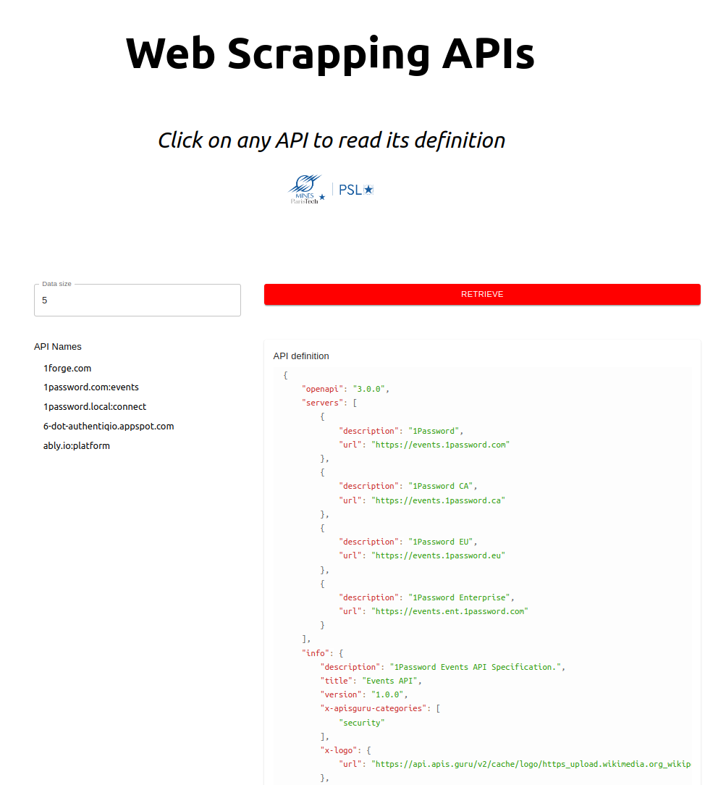

# Web Scraping APIS
This a web application that retrieves data information as https://apis.guru/ 

I learned about web scraping while working on this project.

Start the backend by (create your own venv):
```console
$ cd backend
$ source venv/bin/activate
$ python api.py
```

Start the frontend by:
```console
$ cd frontend
$ npm start
```

Here is a screenshot of the web app:


